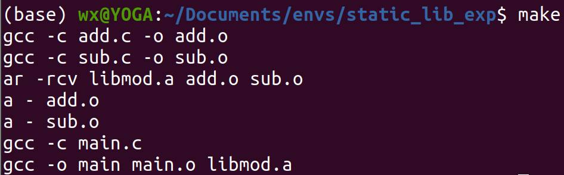
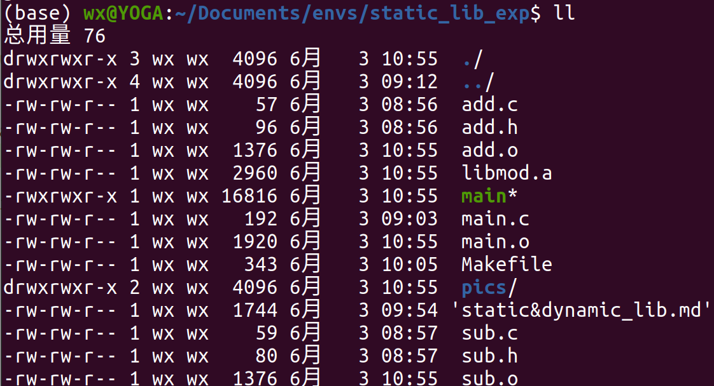
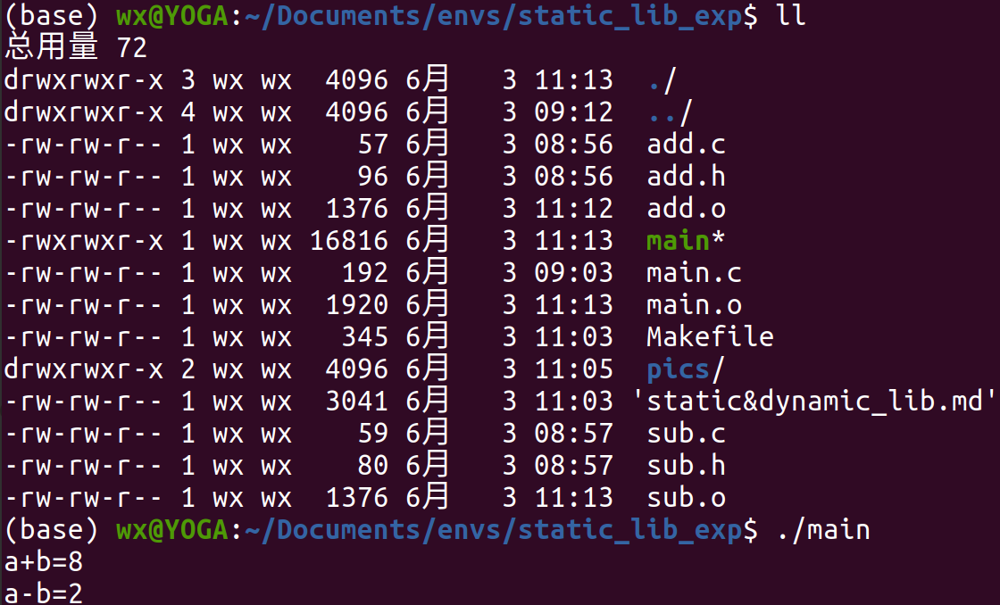
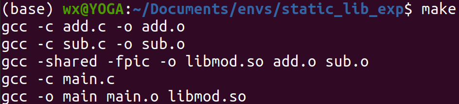
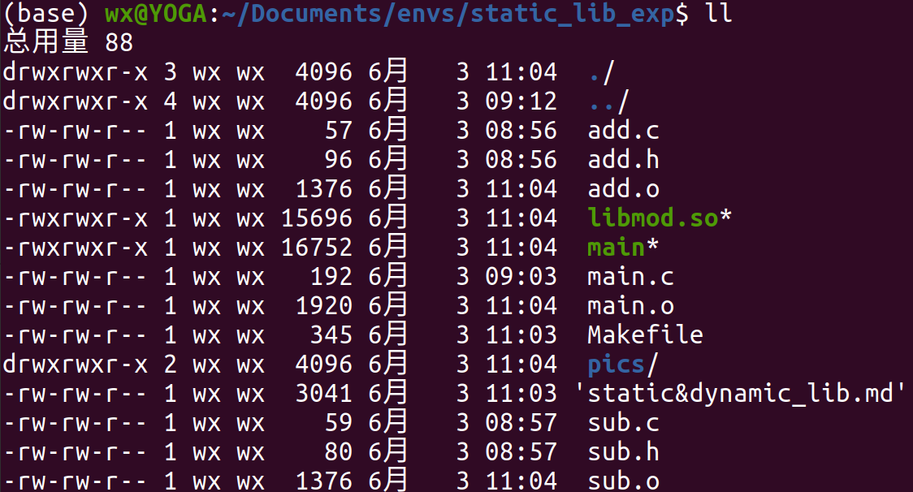

# 【静态库】和【动态库】

## 什么是【静态库】和【动态库】

【静态库】在程序链接过程被直接链接到目标代码中，因此静态库在程序运行时需要被完整地复制到目标文件中。静态库的优点是链接时可以共享，节省内存空间；缺点是如果静态库被修改，则所有使用该静态库的程序都需要重新链接。

【动态库】在程序运行时由系统动态加载到内存中，供程序调用，系统只加载一次，多个程序可以共享同一个动态库。动态库的优点是升级、修改、添加功能时，只需要重新编译和链接，不需要重新安装，不需要重新部署，不需要重新启动，因此动态库具有更好的灵活性和可扩展性；缺点是动态库在程序运行时需要被完整地复制到内存中，因此动态库在程序运行时需要更多的内存空间。

## 通过编程了解【静态库】和【动态库】的区别

在add.h文件中声明一个加法函数。
``` c
/****** add.h ******/
#ifndef __ADD_H__
#define __ADD_H__

// 声明一个加法函数
int add(int a, int b);

#endif // __ADD_H__
```

实现这个加法函数
``` c
/****** add.c ******/
#include"add.h"

int add(int a,int b) {
    return a+b;
}
```

声明减法函数
``` c
/****** sub.h ******/
#ifndef __SUB_H__
#define __SUB_H__

int sub(int a, int b);

#endif // __SUB_H__
```

实现减法函数
``` c
/****** sub.c ******/
#include "sub.h"

int sub(int a, int b) {
    return a-b;
}
```

编写主函数
``` c
#include<stdio.h>
#include<stdlib.h>
#include"add.h" // 使用我们自定义的函数
#include"sub.h"

int main() {
    int a=5;
    int b=3;
    printf("5+3=%d\n", add(a,b));
    printf("5-3=%d\n", sub(a,b));
    return 0;
}
```

关键来了，如何用add.h、add.c、sub.h、sub.c四个文件间生成【静态库】或者【动态库】呢？

<b>1、对于静态库的生成，</b>在已经生成add.o和sub.o目标文件的前提下，使用命令如下生成libmod.a静态库。
``` shell
ar -rcv libmod.a add.o sub.o
```
完整的makefile文件内容如下：
``` makefile
main: libmod.a main.o
	gcc -o main main.o libmod.a

libmod.a: add.o sub.o
	ar -rcv libmod.a add.o sub.o

add.o: add.c
	gcc -c add.c -o add.o

sub.o: sub.c
	gcc -c sub.c -o sub.o

main.o: main.c
	gcc -c main.c

clean:
	rm -f main main.o sub.o add.o libmod.a

```
编译过程及结果如下面两张图所示:



为证明静态库在链接过程，已经并入了main文件，使用```rm libmod.a```命令删除libmod.a静态库，```./main```运行main文件，结果如图所示：


<b>2、对于动态库的生成，</b>在已经生成add.o和sub.o目标文件的前提下，使用命令如下生成libmod.so静态库。

``` shell
gcc -shared -fpic -o libmod.so add.o sub.o
```

完整makefile内容如下：
``` makefile
main: libmod.so main.o
    gcc -o main main.o libmod.so

libmod.so: add.o sub.o
    gcc -shared -fpic -o libmod.so add.o sub.o

add.o: add.c
	gcc -c add.c -o add.o

sub.o: sub.c
	gcc -c sub.c -o sub.o

main.o: main.c
	gcc -c main.c

clean:
	rm -f main main.o sub.o add.o libmod.so

```

动态库编译过程及结果如下面两张图所示:



对于生成的动态库，要使用```sudo cp libmod.so /usr/lib```将其拷贝到/usr/lib目录下，否则在编译其他程序时会提示找不到该动态库。拷贝后运行```./main```可以输出正确的结果。